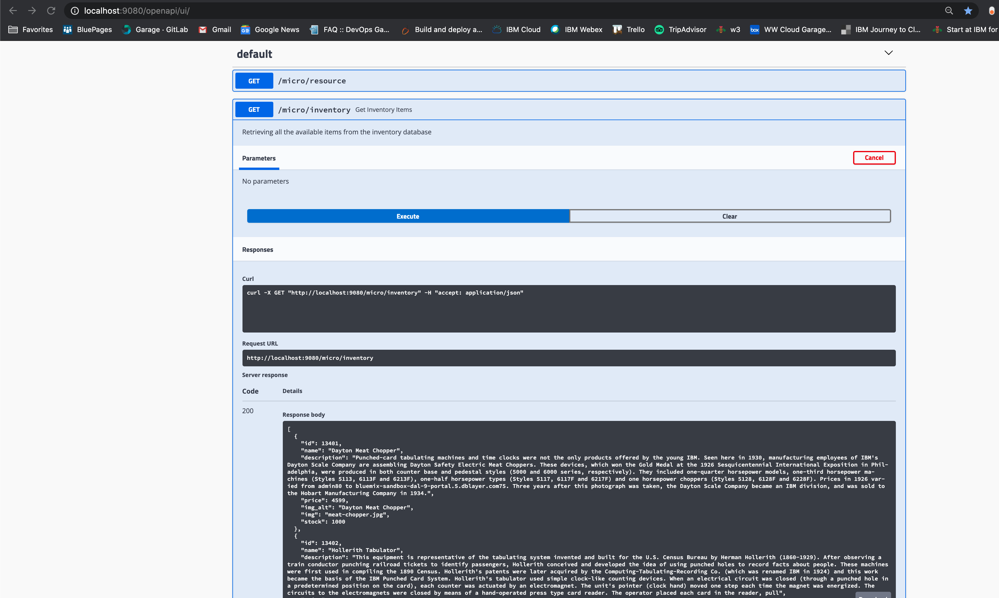

# inventory-ms-openliberty: Openliberty Microservice with MySQL

## Table of Contents

* [Pre-requisites](#pre-requisites)
* [Run Locally](#run-locally)

## Pre-requisites:
* [Appsody](https://appsody.dev/)
    + [Installing on MacOS](https://appsody.dev/docs/installing/macos)
    + [Installing on Windows](https://appsody.dev/docs/installing/windows)
    + [Installing on RHEL](https://appsody.dev/docs/installing/rhel)
    + [Installing on Ubuntu](https://appsody.dev/docs/installing/ubuntu)
For more details on installation, check [this](https://appsody.dev/docs/installing/installing-appsody/) out.
* Docker Desktop
    + [Docker for Mac](https://docs.docker.com/docker-for-mac/)
    + [Docker for Windows](https://docs.docker.com/docker-for-windows/)
    
    
## Run Locally
To run this microservice locally run the following commands
1. Clone repository: 
      ```
      git clone https://github.com/ibm-garage-ref-storefront/inventory-ms-openliberty
      cd inventory-ms-openliberty
      ```
2. Set up MySQL container by running the following command:
      ```
       cd mysql
       docker build -t mysql .
       docker run -p 9041:3306 -d --name mysql -e MYSQL_ROOT_PASSWORD=password mysql
       docker ps
      ```
   You should have the following output:
   ```bash
   CONTAINER ID        IMAGE                           COMMAND                  CREATED             STATUS              PORTS                                                                    NAMES
   de3aa533f067        mysql:5.7.14                    "docker-entrypoint.s…"   27 hours ago        Up 27 hours         0.0.0.0:9041->3306/tcp   
   ```
3. Set up environment variables
    export MYSQL_HOST=host.docker.internal
    export MYSQL_PORT=9041
    export MYSQL_DATABASE=inventorydb 
    export SSL_ENABLED=true 
    export MYSQL_USER=dbuser 
    export MYSQL_PASSWORD=password
    export url=jdbc:mysql://${MYSQL_HOST}:${MYSQL_PORT}/${MYSQL_DATABASE}?useSSL=${SSL_ENABLED}
    export dbuser=${MYSQL_USER}
    export dbpassword=${MYSQL_PASSWORD}
4. Run the application
    ```
     appsody run --docker-options "-e jdbcURL=$url -e dbuser=$dbuser -e dbpassword=$dbpassword"
    ```
   If this runs successfully, you will be able to see the below messages.
    
    ```
    [Container] [INFO] Connection gotten: com.mysql.jdbc.JDBC4Connection@68236731.
    [Container] [INFO] Tests run: 2, Failures: 0, Errors: 0, Skipped: 0, Time elapsed: 1.205 s - in it.dev.appsody.starter.HealthEndpointTest
    [Container] [INFO] 
    [Container] [INFO] Results:
    [Container] [INFO] 
    [Container] [INFO] Tests run: 3, Failures: 0, Errors: 0, Skipped: 0
    [Container] [INFO] 
    [Container] [INFO] Integration tests finished.
    [Container] [INFO] Running unit tests...
    [Container] [INFO] Unit tests finished.
    [Container] [INFO] Running integration tests...
    ```
5. Validate the REST API by visiting the following links:
    - http://localhost:9080/openapi/ui/
    - http://localhost:9080/index.html
    - http://localhost:9080/health
    - http://localhost:9080/openapi
    - http://localhost:9443/ibm/api/

Visit http://localhost:9080/openapi/ui/ and test the rest end point `micro/inventory`
as shown below:

